# Proyecto Base de Datos

## Ejecucion

-   Puede clonar el repositorio
-   Despues ejecutar

´´´
g++ -g -o eject main.cpp && ./eject 
´´´
## Primera Ejecucion

Ejemplo :

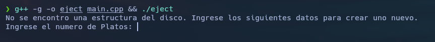

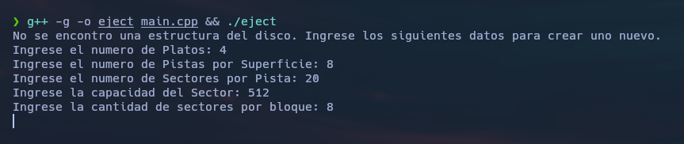

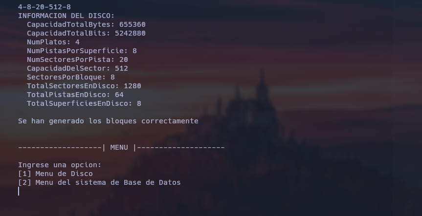

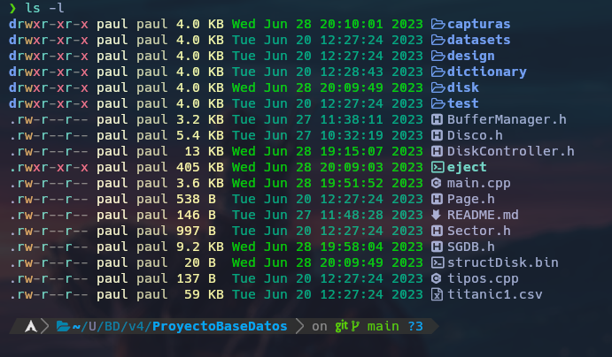

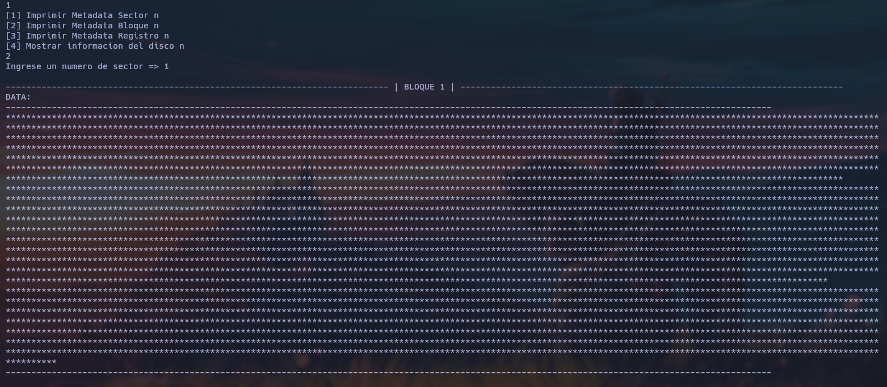

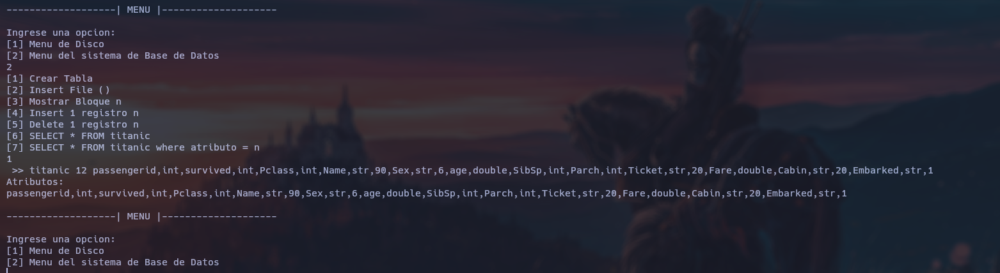

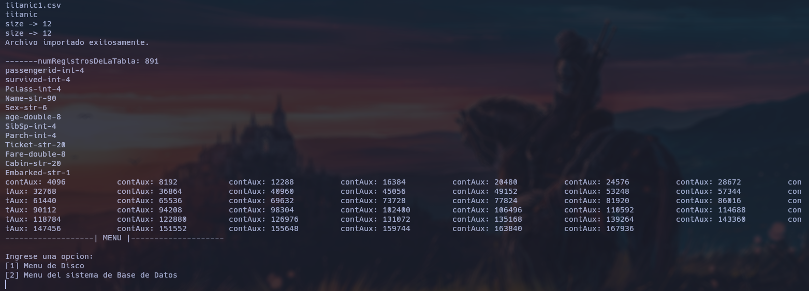

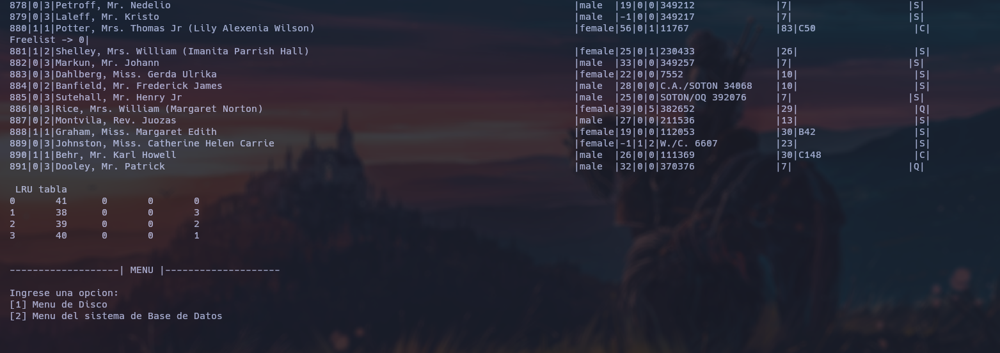

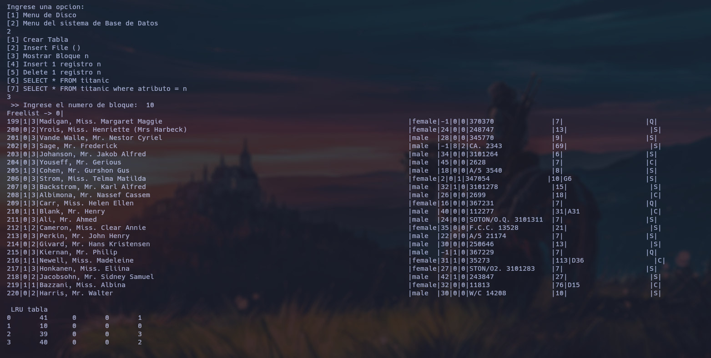

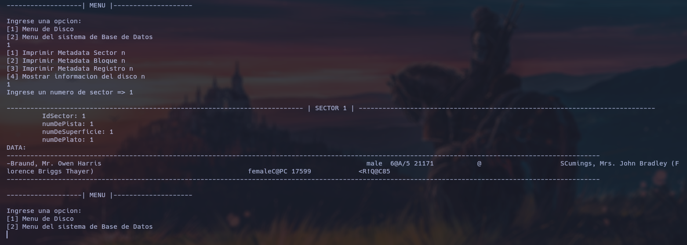

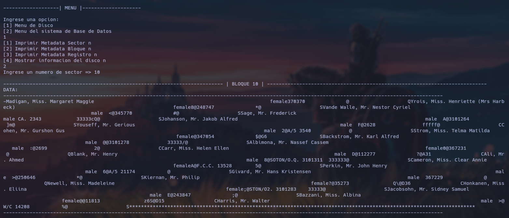

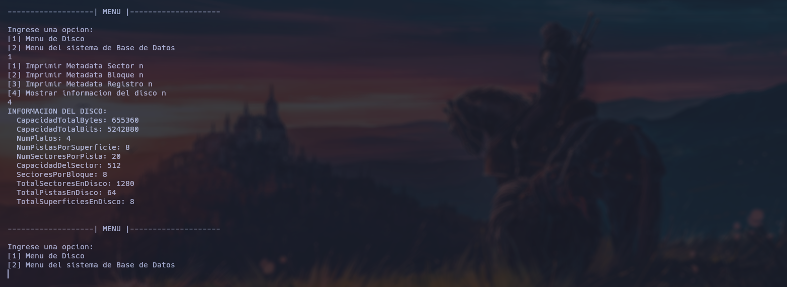

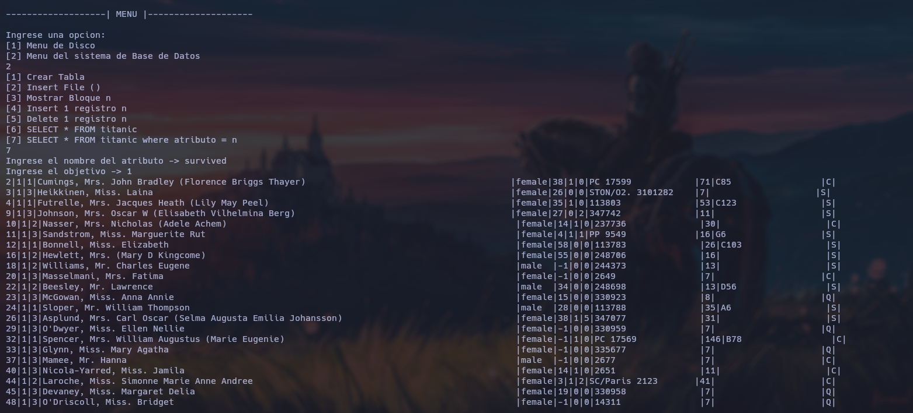

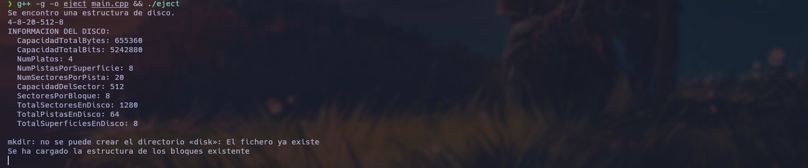

